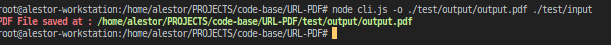

<h1 align=center>URL-PDF</h1>

> This is a simple code for converting array of images to pdf(image urls,image dir,image paths)

<p align=center>

<a href="https://github.com/alestor123/URL-PDF/issues">
</a>

<a href="https://www.npmjs.com/package/url-pdf"></a>
</p>
<p align=center>
<a href="https://npmjs.org/package/url-pdf">
</a>
</p>

## 🚀 Usage

## API

```
const urlPDF = require('./App')
urlPDF(['https://timeandtidewatches.com/wp-content/uploads/2020/12/Mission-Impossible-Fallout-pc-games_b2article_artwork.jpg', 'https://i.redd.it/inh40ta5xww51.jpg', 'https://i0.wp.com/thequotes.me/wp-content/uploads/2017/07/wp-image-770695090.jpg?fit=1200%2C800&ssl=1', 'https://static1.colliderimages.com/wordpress/wp-content/uploads/2021/08/Mission-Impossible-Ghost-Protocol-Villain.jpg', 'https://i.pinimg.com/originals/88/30/ba/8830ba2ea15483d8e69d2a6b3fa7afeb.jpg', 'https://alternativemovieposters.com/wp-content/uploads/2020/05/andreypankov_mifallout.jpg', './test/input/'], './test/output/out.pdf')

```

## Quick use
```
$ npx  -s <path>
```
## CLI Installation
```
$ npm install -g url-pdf
```
```
$ url-pdf -o <path> <input image paths>
```

``  <input image paths> `` is optional(by default it will take cwd)

# Screenshots    




## 💖 [Donate](https://alestor123.is-a.dev/donate)


## Author

👤 **Alestor Aldous**

- Twitter: [@alestor123](https://twitter.com/alestor123)
- Github: [@alestor123](https://github.com/alestor123)


## 📝 License
> MIT

Copyright © 2022 [Alestor Aldous](https://github.com/alestor123).<br />
